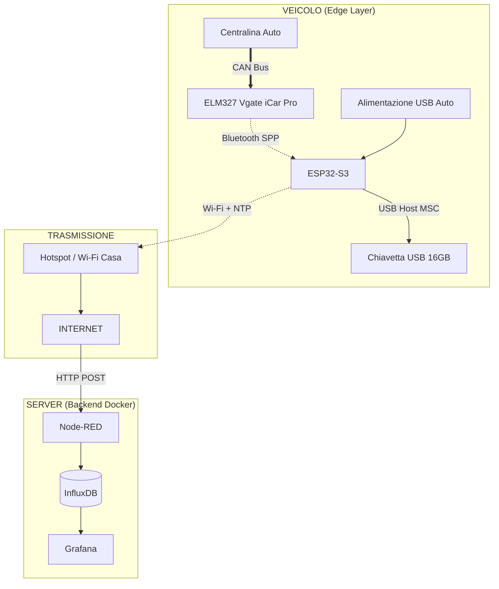

| Supported Targets | ESP32-S3 |
| ----------------- | -------- |

# Sistema di Telemetria Veicolare IoT (Store & Forward)

Questo progetto implementa una "Black Box" (scatola nera) intelligente per veicoli basata sul microcontrollore **ESP32-S3**. Il sistema acquisisce dati dalla centralina dell'auto (ECU) tramite protocollo OBD-II, li salva localmente su memoria USB e li sincronizza automaticamente con un server remoto quando è disponibile una connessione Wi-Fi.

## 🎯 Obiettivo del Progetto

Realizzare un dispositivo autonomo capace di:
1.  **Leggere** i parametri del veicolo (RPM, Velocità, Temperature, PID Estesi VAG) tramite interfaccia OBD-II Bluetooth.
2.  **Storicizzare** i dati in locale (su Chiavetta USB) per garantire zero perdita di dati anche in assenza di segnale 4G/Internet.
3.  **Inviare** i dati accumulati a un server casalingo (Self-Hosted) non appena viene rilevata una rete nota (Hotspot Smartphone o Wi-Fi Casa).

## 📐 Architettura del Sistema

Il sistema segue un approccio **Store & Forward ibrido**:



## 🛠️ Hardware Richiesto

Per replicare il progetto è necessario il seguente hardware:

* **Microcontrollore:** [Espressif ESP32-S3 DevKitC-1](https://docs.espressif.com/projects/esp-idf/en/latest/esp32s3/hw-reference/esp32s3/user-guide-devkitc-1.html) (Scelto per supporto nativo USB Host e Dual Core).
* **Interfaccia OBD:** Vgate iCar Pro 3.0 (Bluetooth Classic). *Nota: Non usare versioni BLE o cloni economici v2.1.*
* **Storage:** Chiavetta USB 2.0 (16GB o 32GB consigliato) formattata FAT32.
* **Adattatore:** USB Type-C OTG (da USB-C Maschio a USB-A Femmina).
* **Alimentazione:** Cavo USB collegato alla porta USB/Accendisigari del veicolo.

## 💻 Logica Firmware

Il firmware è sviluppato in **ESP-IDF** (C/C++) e utilizza **FreeRTOS** per gestire il multitasking:

1. **Task Data Logger (Priorità Alta):**
* Mantiene la connessione SPP (Serial Port Profile) con l'adattatore OBD.
* Interroga ciclicamente i PID (es. `010C` per RPM).
* Sincronizza l'orario via NTP (se connesso) o usa tempo relativo.
* Formatta i dati in JSON e li scrive in *append* sulla chiavetta USB (montata come MSC).


2. **Task Network Uploader (Background):**
* Scansiona ciclicamente le reti Wi-Fi configurate (Hotspot/Casa).
* Se connesso: "ruota" i file di log correnti e invia i dati storici al server tramite **HTTP POST**.
* Cancella i file dalla chiavetta solo dopo conferma (`200 OK`) dal server.


## 📂 Struttura del Progetto

```
├── CMakeLists.txt
├── main
│   ├── CMakeLists.txt
│   ├── main.c              # Entry point e inizializzazione HW
│   ├── obd_bluetooth.c     # Gestione stack Bluetooth Classic (SPP)
│   ├── usb_storage.c       # Gestione USB Host MSC (Mount/Write/Read)
│   └── network_upload.c    # Gestione Wi-Fi, NTP e HTTP Client
└── README.md

```

## 🚀 Guida all'installazione

### 1. Configurazione Ambiente

Assicurati di avere installato ESP-IDF v5.0 o superiore.

```bash
idf.py set-target esp32s3

```

### 2. Configurazione Menuconfig

È necessario abilitare Bluetooth Classic e USB Host.

```bash
idf.py menuconfig

```

* **Component config -> Bluetooth:** Abilitare "Bluetooth" e "Classic Bluetooth" (SPP).
* **Component config -> USB Host:** Abilitare driver MSC.
* **Project Configuration:** Inserire SSID e Password dell'Hotspot e Indirizzo MAC dell'ELM327.

### 3. Build e Flash

Collega l'ESP32-S3 tramite la porta **UART** (non quella USB OTG) per il flash.

```bash
idf.py build flash monitor

```

## ⚠️ Limitazioni Attuali (MVP)

* **Timestamp:** Il progetto attuale non utilizza un modulo RTC hardware (DS3231). L'orario viene sincronizzato via NTP quando l'hotspot è attivo. Se l'hotspot è spento, i log utilizzeranno un timestamp relativo (o data 1970).
* **Alimentazione:** Il dispositivo si spegne con l'auto. L'upload dei dati avviene principalmente durante la guida tramite Hotspot.

## 📊 Backend (Docker)

Il server riceve i dati JSON. Esempio di configurazione Node-RED/InfluxDB:

* **Endpoint:** `POST /api/telemetria`
* **Formato JSON:** `{"ts": 1700000, "rpm": 2500, "speed": 85}`

---

**Autore:** [Tuo Nome]
**Università:** [Tua Università]
**Anno:** 2024/2025
